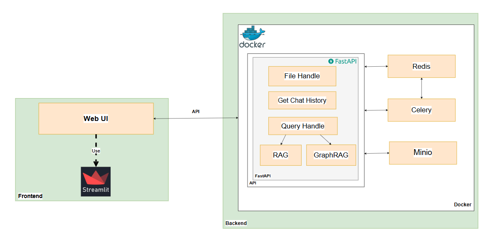
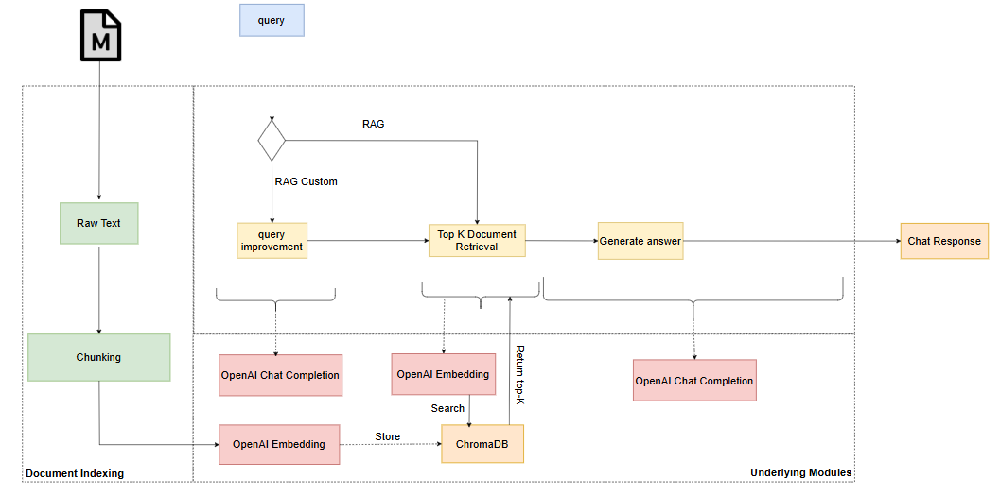
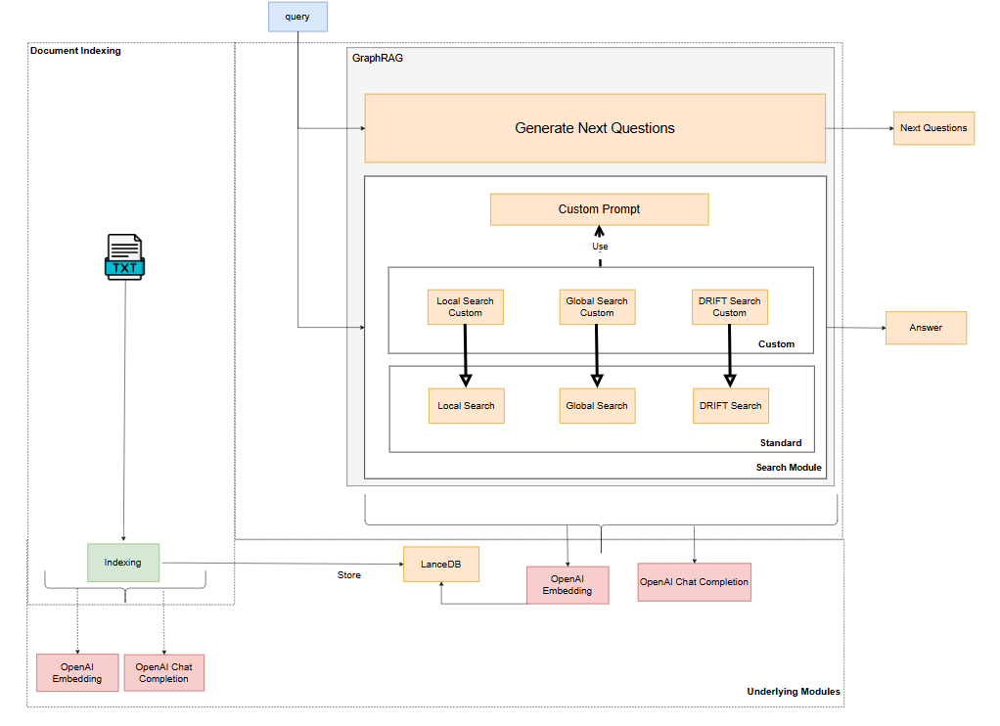
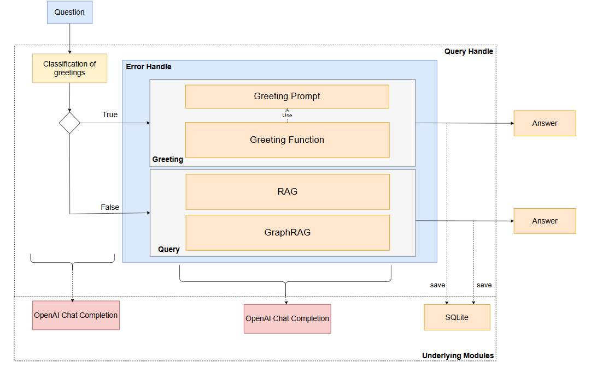
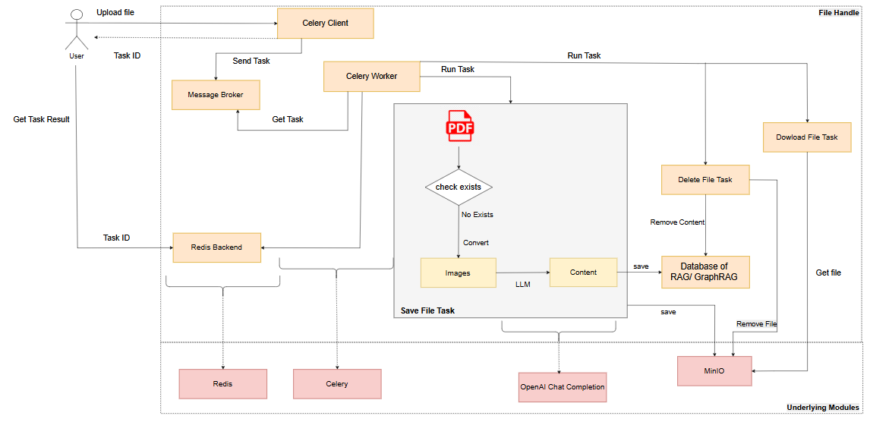
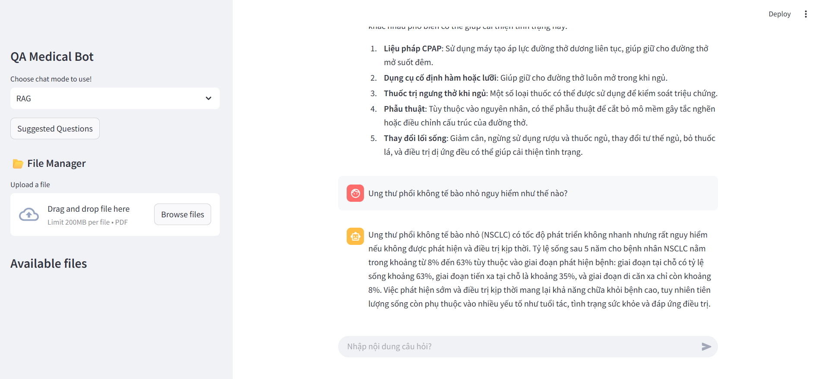

# Nghiên cứu cách kết hợp các kỹ thuật RAG và GraphRAG cho bài toán Chatbot trong Y tế 

- [Nghiên cứu cách kết hợp các kỹ thuật RAG và GraphRAG cho bài toán Chatbot trong Y tế](#nghiên-cứu-cách-kết-hợp-các-kỹ-thuật-rag-và-graphrag-cho-bài-toán-chatbot-trong-y-tế)
  - [1. Giới thiệu về đề tài](#1-giới-thiệu-về-đề-tài)
  - [2. Đề xuất cải tiến](#2-đề-xuất-cải-tiến)
    - [2.1 RAG.](#21-rag)
    - [2.2 GraphRAG](#22-graphrag)
    - [2.3. Đề xuất độ đo mới cho chatbot.](#23-đề-xuất-độ-đo-mới-cho-chatbot)
  - [3. Triển khai hệ thống](#3-triển-khai-hệ-thống)
  - [4. Các bước thực thi ứng dụng](#4-các-bước-thực-thi-ứng-dụng)
  - [5. Kết quả](#5-kết-quả)


## 1. Giới thiệu về đề tài

Đồ án này tập trung nghiên cứu và so sánh hai kỹ thuật hiện đại trong xây dựng hệ thống chatbot dựa trên dữ liệu y tế: **RAG (Retrieval-Augmented Generation)** và **GraphRAG**.  

- **RAG** là phương pháp kết hợp giữa truy xuất thông tin và sinh văn bản, cho phép chatbot trả lời câu hỏi dựa trên tài liệu đầu vào. Tuy nhiên, kỹ thuật này gặp hạn chế khi xử lý dữ liệu lớn do quá trình chia nhỏ văn bản (chunking), làm mất đi tính kết nối ngữ nghĩa giữa các phần dữ liệu liên quan.

- **GraphRAG** được phát triển nhằm khắc phục điểm yếu này bằng cách xây dựng đồ thị tri thức để liên kết các thực thể trong tập dữ liệu. Tuy nhiên, GraphRAG hiện vẫn còn hiện tượng "hallucination" (sinh ra thông tin không tồn tại trong dữ liệu gốc), và hỗ trợ chủ yếu cho tiếng Anh.

Để cải thiện hiệu quả của hệ thống chatbot:

- Với **RAG**, đồ án đề xuất cải tiến chiến lược chia nhỏ dữ liệu và tăng cường ngữ cảnh truy xuất nhằm nâng cao độ chính xác của câu trả lời.
- Với **GraphRAG**, đề xuất kế thừa mô hình có sẵn và tinh chỉnh các prompt để giảm hallucination và hỗ trợ sinh câu trả lời bằng tiếng Việt.

Hệ thống chatbot được triển khai dưới dạng website, hỗ trợ:
- Xử lý dữ liệu tự động
- Giao tiếp với chatbot thông qua giao diện người dùng
- Lưu trữ lịch sử hội thoại
- Thực thi các tác vụ nền bằng Celery kết hợp Redis

Toàn bộ hệ thống được đánh giá bằng thư viện RAGAS, bộ công cụ chuyên đo lường hiệu quả truy xuất và sinh câu trả lời trong hệ thống RAG. Ngoài ra, đồ án cũng đề xuất hai chỉ số đánh giá mới nhằm khắc phục hạn chế của các tiêu chí đánh giá truyền thống trong RAGAS.

Kết quả thực nghiệm cho thấy, cả hai mô hình RAG và GraphRAG sau khi được cải tiến đều cho kết quả tốt hơn hơn phiên bản gốc, đồng thời cho hiệu suất tốt hơn so với **ChatGPT** và **Google AI Studio** khi được thử nghiệm trên cùng tập dữ liệu y tế.
## 2. Đề xuất cải tiến
### 2.1 RAG.
Trong dự án này, tôi đề xuất một số cải tiến cho mô hình RAG truyền thống nhằm giảm hiện tượng **hallucination** và nâng cao độ chính xác của câu trả lời, đặc biệt khi áp dụng cho tiếng Việt. Các cải tiến bao gồm:
**Nâng cao khả năng hiểu và mở rộng truy vấn:**

- **Tách thực thể quan trọng**: Trích xuất các khái niệm cốt lõi để tăng độ khớp với dữ liệu.
- **Sinh truy vấn mô phỏng bằng LLM**: Dùng LLM tạo ra một câu trả lời mẫu từ kiến thức sẵn có, sau đó sử dụng làm truy vấn mở rộng.

**Chiến lược chunking theo ngữ nghĩa**

- **Chunk theo heading Markdown**: Giữ được ngữ cảnh nội dung, bám sát cấu trúc tài liệu.
- **Chia nhỏ đoạn dài tại điểm ngắt tự nhiên**: Dựa vào dấu chấm, xuống dòng để đảm bảo mỗi chunk là một đơn vị ngữ nghĩa hoàn chỉnh.
- **Chunk Overlap**: Áp dụng chồng lặp giữa các đoạn để duy trì mạch văn.
- **Gắn metadata cho mỗi chunk**.

**Cải thiện khả năng sinh câu trả lời**
Để tăng độ tin cậy của câu trả lời, tôi tinh chỉnh **prompt** đầu vào như sau:

- **Xác định rõ vai trò mô hình**: Ví dụ, “Bạn là chatbot y tế chuyên tư vấn sức khỏe”.
- **Chỉ sử dụng thông tin từ chunk được truy xuất**: Không suy đoán nếu dữ liệu không có.
- **Xử lý khi thiếu thông tin**: Trả lời mặc định: *"Xin lỗi, dữ liệu hiện tại không có thông tin về vấn đề này."*
- **Bắt buộc trích dẫn nguồn**: Truy xuất đoạn chunk được lấy thông tin để sinh ra câu trả lời.
- **Đảm bảo ngôn ngữ tiếng Việt và văn phong chuẩn xác, dễ hiểu**.
### 2.2 GraphRAG
**Các chiến lược truy vấn chính**
- **Local Search**: Truy vấn chi tiết qua thực thể liên quan.
- **Global Search**: Tìm câu trả lời tổng quát từ tóm tắt đồ thị.
- **DRIFT Search**: Kết hợp hai phương pháp trên, cho phép suy luận đa bước.

**Hạn chế khi áp dụng vào tiếng Việt**
- Không hỗ trợ tiếng Việt mặc định → dễ trả lời bằng tiếng Anh.
- Không kiểm soát hiện tượng **bịa (hallucination)**.
- DRIFT Search dễ tạo ra suy luận ngoài dữ liệu gốc.

**Đề xuất cải tiến**

- Thiết kế lại 3 lớp: `LocalSearch`, `GlobalSearch`, `DriftSearch`.
- Prompt được **tách khỏi mã nguồn**, lưu trong tệp riêng.
- Prompt mới tuân thủ 3 nguyên tắc:
  1. Trả lời bằng tiếng Việt.
  2. Chỉ dùng dữ liệu truy xuất.
  3. Trả lời rõ ràng nếu không có dữ liệu phù hợp.

### 2.3. Đề xuất độ đo mới cho chatbot.

**Hạn chế của RAGAS**
- Phụ thuộc vào **Ground Truth ngắn**, gây đánh giá thấp với câu trả lời đầy đủ, mang tính mở rộng thông tin.
- Mô hình trả lời đúng "không biết" cũng bị đánh thấp vì không khớp nội dung trong câu hỏi.
**Đề xuất độ đo Real Content Score (RCS)**
Real Content Score (RCS) là độ đo đánh giá mức độ chính xác thực tế của câu trả lời bằng cách đối chiếu từng thông tin nhỏ trong câu trả lời với tài liệu truy xuất. RCS phản ánh khả năng mô hình sinh ra nội dung đúng dựa trên dữ liệu thật, thay vì tạo ra thông tin không có trong tài liệu (hallucination).

Công thức: 
```
RCS = Smatch / Stotal (nếu Stotal > 0, ngược lại RCS = 0)
```

- `Smatch`: Số thông tin khớp với tài liệu.
- `Stotal`: Tổng số thông tin sinh ra trong câu trả lời.

**Đề xuất độ đo Real Content Multi-mode Score (RCMMS)**

Real Content Multi-mode Score (RCMMS) mở rộng từ RCS, kết hợp hai yếu tố: độ chính xác (Precision) và độ bao phủ (Coverage). Chỉ số này không chỉ đo mô hình nói đúng bao nhiêu, mà còn đo xem mô hình đã khai thác đủ các thông tin cần thiết trong tài liệu chưa, giúp đánh giá toàn diện chất lượng câu trả lời.


Công thức:

```
RCMMS = α · Precision + β · Coverage
```

Trong đó:

- `Precision = Smatch / Stotal` (nếu Stotal > 0, ngược lại = 0)
- `Coverage = Smatch / Smatch-max` (nếu Smatch-max > 0, ngược lại = 1)
- `α + β = 1`: Hệ số điều chỉnh ưu tiên giữa độ chính xác và độ bao phủ.

## 3. Triển khai hệ thống
**Kiến trúc tổng quan**



**Kiến trúc xử lý RAG**



**Kiến trúc xử lý GraphRAG**



**Xử lý truy vấn người dùng**



**Xử lý tệp dữ liệu**



## 4. Các bước thực thi ứng dụng
 - Xem chi tiết các bước thực hiện trong [docs](./reproduce.md)
## 5. Kết quả
**Giao diện trang web**

**Kết quả đánh giá**
Chi tiết kết quả đánh giá xem tại: [Đánh giá](./evaluate/results/images/)